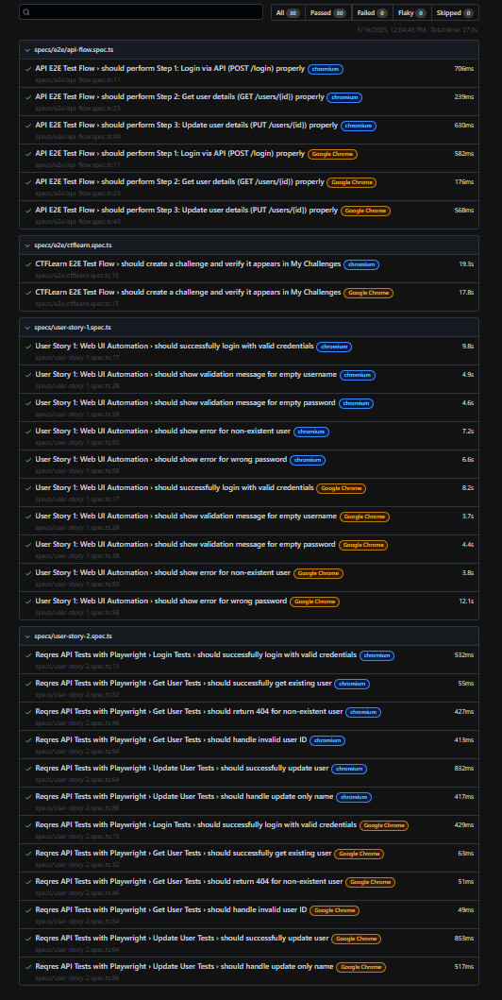

# A. Modern QA Mindset

##  1. Test Automation Solution
### Propose a high-level, comprehensive test Automation Strategy:

**1. Implementation Plan**

*UI/E2E Tests (40%):*
- Business Workflow
- Cross-browser Testing (Chrome, Chromium, Edge, ...)
- Visual Testing(Responsive check)

*API Tests (40%):*
- CRUD Operations
- Error Handling (status return 400, 500, ....)
- Data Validation (Defined rules, data format and expected response)

*Non-Functional Test (20%):*
- Performance Testing (Page Load Times, API Response Times, Resource usage)
- Security Testing (Authentication, Authorization, Input Validation)

**2. Framework Structure (By Playwright)**

```
framework/
├── tests/
│   ├── api/                    # API Clients & Methods
│   │   ├── base                # Common methods: GET, POST, PUT, DELETE, ...
|   |   └── services            # Feature-specific API services
│   ├── specs/                  # Test Specifications
│   │   ├── e2e/                # End-to-End UI Tests
│   │   └── api/                # API Tests
│   ├── pages/                  # Page Objects
│   ├── core/                   # Framework Core
│   │   ├── models/             # Test Data Models

│   │   │   └── globalSetup
│   │   │── helpers/            # Utility Functions
│   │   ├── setup/              # Global Setup
│   │       └── globalInit
├── package.json                # Project Dependencies
└── .env                        # Environment Variables
```

**3. Implementation Approach**
- Setup basic framework
- Implement core
- Create Page Objects
- Create basic test script

**4. Execution & Reports**
- The framework supports running different test suites separately or all at once:
```
Run test only for E2E  # yarn test:e2e 
Run test only for API  # yarn test:api
Run all test           # yarn test:all
```
- Generate HTML file (total, passed, failed, skipped cases)
- Capture image if needed

**5. CI/CD Integration (Jenkins Pipeline Structure)**
- Build
- Test
- Report
- Deploy

### What frameworks, tools, and technologies would you choose for automating tests?
**Web + API**
- Nodejs: Javascript runtime built-in 
- Playwright: Automation test framework (built-in async/await, cross-browser support, ...)
- Javascript + TypeScript: Programing Language
- Prettier: Code formatting
- Eslint: Code quality (Find and Fix code problems)
- HTML: for test result
- Github: Version Control
- Jenkins: CI/CD
- Slack Notification(through Webhook): for Reporting

**Mobile**
- Appium

**Backend Services**
- Jest for Unit Testing (includes, integration test and assertions)

**Test Management**
- Jira: Bug Tracking, Agile Project Management
- Google Docs, Sheets and Slides: for documentations, auto test activities diagram, timeline
### How would you integrate automation into CI/CD pipelines?
Based on this Pipeline Structure below:
```
properties([pipelineTriggers()])        # Schedules the pipeline to run automatically
node('slave-tests') {
stages {
    stage('BUILD STARTED')              # Initialize build process
    stage('Installation')               # Install dependencies
    stage('Setup Project')              # Setup Framework and browsers
    stage('Run Tests') {
        parallel {
            stage('E2E Tests')          # Execute UI tests
            stage('API Tests')          # Execute API tests
            stage('Regression Test')    # Run all test scripts
        }
    }
    stage('Process Test Results')  # Generate reports
}
}
```
### How do you ensure maintainability and scalability of the automation framework?
Make sure my code is organized by following as below:
- Set it up as Page Object Model
- Test Layer for each page as example below:
```
specs/                      # Test Specifications
├── api/                    # API Tests
│    ├── loginFlow/         # Login API Tests
│    ├── userFlow/          # User API Tests (Apply CRUD Methods)
│    └── navigations/       # All page are loaded Test Scripts
└── e2e/                    # End-to-End UI Tests
     ├── featureA/          # Feature A UI Tests
     ├── featureB/          # Feature B UI Tests
     └── featureC/          # Feature B UI Tests
```
- Core, API and Service Layers should be well structured.
##  2. AI Integration in QA Testing
### Integrate AI into the QA and testing process to improve productivity and enhance quality?
-   Enhance productivity and quality by automating repetitive tasks
-   Cover deeply insights of human tester might be miss
-   Can support time-consuming tasks (generate test cases)
-   Suggest for edge cases, predicting risks, improve the test precision
-   Cover for missing expectation of each case
-   Detecting duplication test data, selectors, test cases
-   Recommend for test coverage optimizations, summarize the test result
### What AI-powered tools or methodologies would you use for intelligent test execution,
### predictive defect analysis, and self-healing tests?
Maybe there have other AI powered-tool have better support but i would like to introduce these tools as below:
**Intelligent Test Execution: Applitools**
-   Visual AI testing
-   Automated visual validation
-   Cross-browser verification
-   Layout testing
**Predictive Defect Analysis & Self-Healing Tests: Mabl**
-   Adaptive Test Execution—learns from production data (if integrated) and test outcomes to focus on high-traffic or unstable areas
-   Element healing by update selectors based on context
### How can AI be leveraged for test coverage optimization and exploratory testing?
**1. Test Coverage Optimization**
-   Code path analysis
-   Test redundancy detection
-   Edge case detection
-   Quality score prediction
-   Impact analysis
-   Optimization recommendations
-   Coverage gap identification
**2. Exploratory Testing**
-   Pattern recognition
-   Unusual behavior detection
-   Learning from user behavior
-   Dynamic test scenarios
-   Data combination suggestions
-   Test flow recommendations
-   Error scenario prediction
It's really reduced testing time, so we focused on testing efforts and proactive on issue detect.
##  3. Performance & Security Assurance
### How do you ensure that your team is building a product that meets performance
### expectations under real-world conditions?
As my thought so:

*Clear Metrics*
-   How much time to load the pages
-   Time for page responding
-   Concurrent user capacity (how many user can access the page properly?)
-   Number of transactions can process within a given time.
-   Capacity and efficency of system can handle.

*User Experience*
-   UI responsiveness
-   Search/Filter response times
-   How long does it take for data table loading
-   Video/Short Video loading speeds (no interruption)

### What strategies and tools would you use to test and monitor system performance, especially
### for high-frequency trading scenarios?
-   Performance Test: JMeter
-   Monitoring: New Relic

### How do you ensure security testing is embedded into the development lifecycle to identify
### and mitigate potential vulnerabilities?
No answer

### What best practices would you follow to comply with security and regulatory standards in an
### online trading platform?
No answer

##  4. Efficient Shift-Left Testing
### How would you apply Shift-Left Testing efficiently in the software development lifecycle?
As my experience, i will apply Shift-Left Testing as early as i can
Based on SDLC:
-   At Requirement phase: Make sure the requirement is clear, might found gaps before next phase begin.
-   Design phase: APi have clear endpoint yet? Validate design document to ensure it's testable. 
-   Develop (Coding phase): create automated test script for API/UI
-   Build & Integration (CI/CD): validate quality on every build/change. 
-   Testing phase: automate regresssion test suits to reduce time for manual exploration, execute e2e workflow and corner cases.

### How can QA collaborate with developers and product teams to enhance early-stage
### quality assurance?
-   Proactive and involve on any stage/phase of SDLC not just testing.
-   Open communication to make sure everyone understand requirements and risks.
-   Meetings are good for clarify, define acceptance criteria, identify risks.(QA, Devs and PO)

### How do you ensure that Unit Testing, Static Code Analysis, and Early Non-Functional
### Testing are effectively integrated into development workflows?
These practices, when embedded early and consistently (aligned with Shift-Left principles), improve code quality, catch defects sooner, and ensure the system meets performance, security, and reliability goals.
-   Shift Left Testing: Introduce these practices at the earliest stages (coding, build).
-   Automation: Minimize manual effort with tools in workflows.
-   Incremental Adoption: Start small, prove value, then scale.
-   Continuous Feedback: Provide real-time, actionable insights.

# B. Test Strategy and Design
### Test Strategy Overview
**1. Test Scope**
-   UI Testing for CTFLearn challenge cre ation
-   API Testing for Reqres user management
-   Mobile Testing for trading app portfolio view

**2. Test Approach**
-   Web UI Testing: Functional, UI, usability, and performance testing
-   API Testing: Functional validation of endpoints and response data
-   Mobile App Testing: Functional, usability and performance testing across devices

**3. Test Environments**
-   Web Testing: Chrome, Firefox, Edge.
-   API Testing: Postman.
-   Mobile Testing: Android and iOS.
### Test Plan: i would like to write a check list test cases for simple the test.
**User Story 1: CTFLearn Challenge Creation**

*Functional Test Cases*
-   Verify Login functional work properly
-   Validation check for Challenge creation form
-   Verify that Challenge is created successfully
-   Challenge is displayed in My Challenges
-   Verify that Challenge is updated succcesfully
-   Verify that Challenge is deleted succesfully
-   Verify Logout functional work properly

*Non-Functional Test Cases*
-   Performance: Page load time
-   Response time of the form
-   Cross-browser campatibility
-   Error messages

**User Story 2: Reqres User Management**

*Functional Test Cases*
-   Login with proper credentials data by POST method
-   Login with invalid data by POST method
-   Retrieve a proper user data by GET method
-   Retrieve a non-existed user by GET method
-   Verify that update an user properly by PUT method
-   Verify that delete an user properly by DELETE method
-   Verify response data of each CRUD method(id, token, email, name, response message, response code, error)

*Non-Functional Test Cases*
-   API response times
-   Request payload validation
-   Authentication check

**User Story 3: Mobile Trading Portfolio**

*Functional Test Cases*
-   Login authentication
-   Portfolio data display
-   Real-time data updates
-   Navigation functionality
-   Logout process

*Non-Functional Test Cases*
-   App performance metrics
-   Device compatibility
-   Offline mode behavior
-   Battery consumption

## Playwright Test Automation Framework Development

This repository contains automated tests built with Playwright for web testing "only".
This source code do not includes [User Story 3] & Mobile App E2E Test Flow

## Prerequisites

- [Node.js] https://nodejs.org/
- [npm] https://www.npmjs.com/ or [Yarn] https://yarnpkg.com/ (Recommended :D)

Basically, i'm familiar with Yarn so i focus to run to Yarn only.

## Setup Instructions

### 1. Clone the Repository

```bash
git clone <repository-url>
cd playwright-test
```

### 2. Install Dependencies

Yarn:

```bash
yarn install
```

### 3. Install Playwright Browsers

```bash
yarn add playwright
```

This will install the browsers required for Playwright tests (Chromium, Firefox, and WebKit).

## Running Tests

### Running Specific Test Suites

Run User Story 1 tests:

```bash
yarn test:us1
```

Run User Story 2 tests:

```bash
yarn test:us2
```

Run E2E tests:

```bash
yarn test:e2e
```

### Running All Tests

```bash
yarn test:all
```

### Viewing Test Report

After running tests, you can view the HTML report:

```bash
yarn report
```

## Configuration

The test configuration is defined in `playwright.config.ts`. Key configurations include:

- Test directory: `./tests`
- Browsers: Chromium and Google Chrome by default
- Headless mode: Currently set to `false` (tests run with browser UI visible)
- Test parallelization: Enabled

## Environment Variables

The project uses environment variables for configuration. Set these in the `.env` file:
`.env file should be stored in private. But for exercise i will add this .env file to my repo`

## Reports


